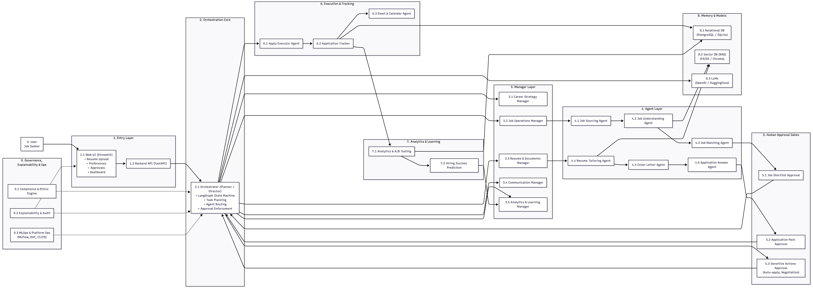
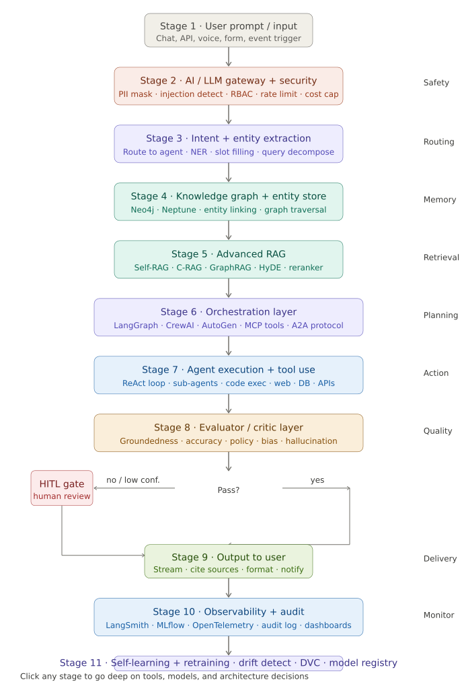
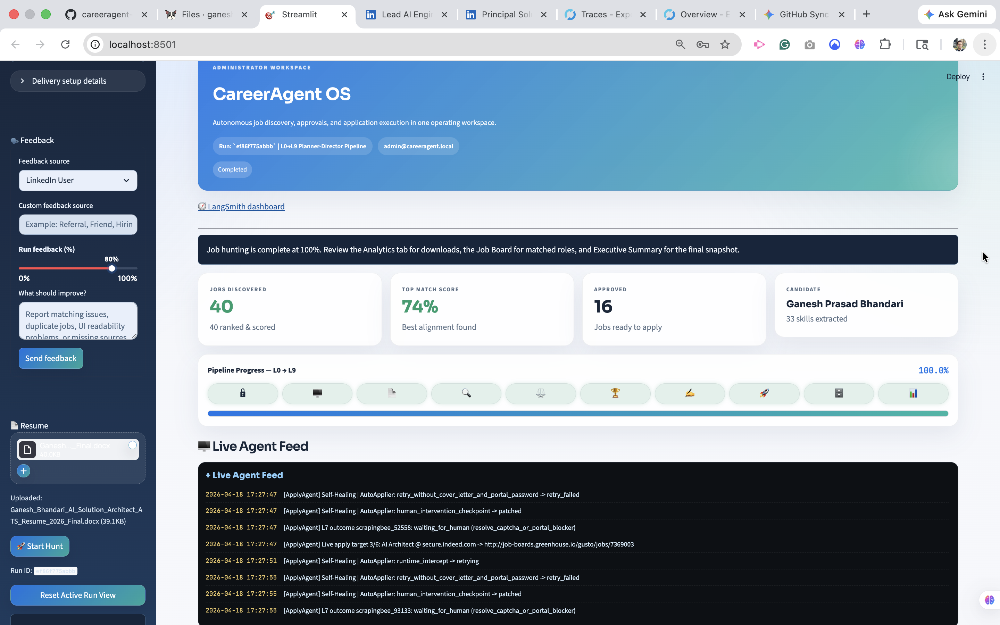
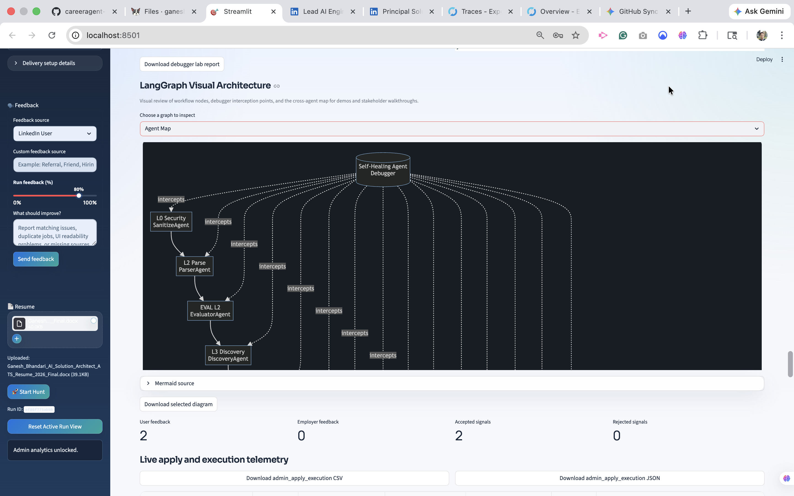
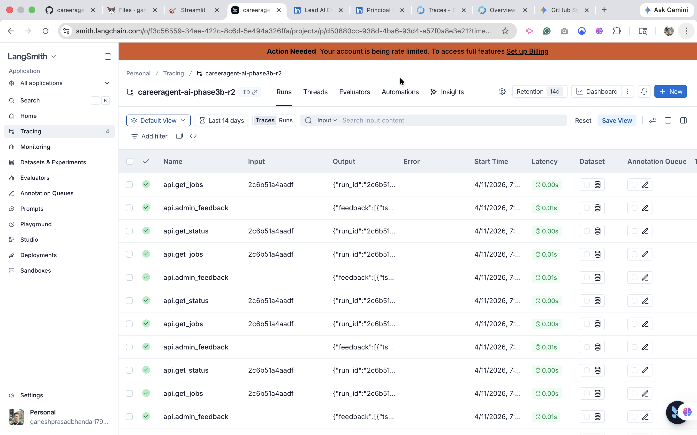
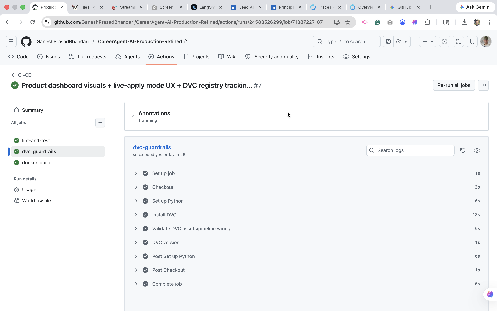
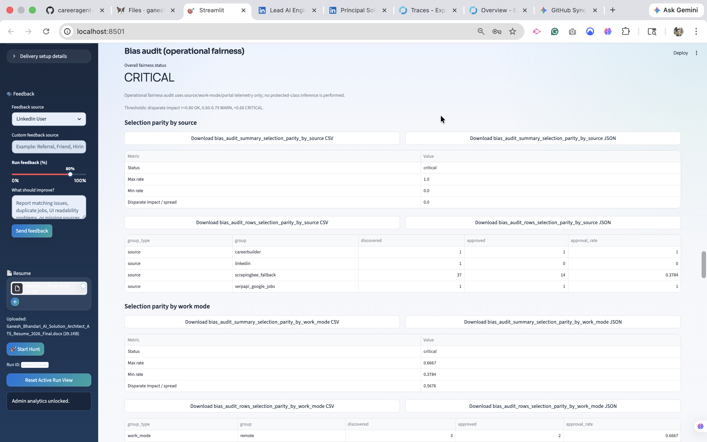
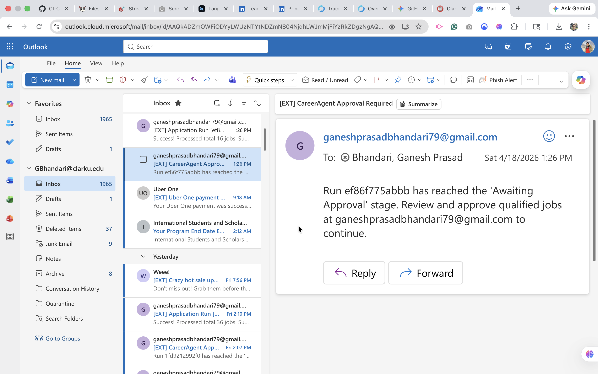
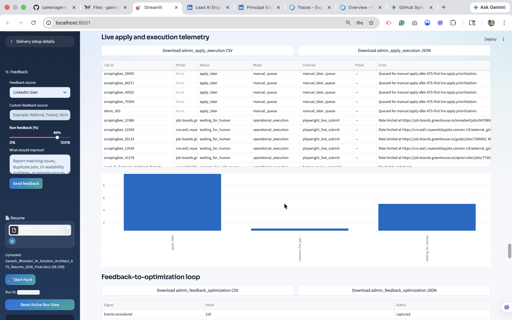

## 🎓 Cite this Research & Authority

**Bhandari, G. P. (2026).**  
*CareerAgent-AI: A Production-Grade 10-Layer Agentic AI Operating System for Governed Career Automation (v1.0).*  

📘 **Technical Whitepaper (Zenodo/CERN):** **https://doi.org/10.5281/zenodo.20299197**  
📌 **DOI:** **[https://doi.org/10.5281/zenodo.20320123](https://doi.org/10.5281/zenodo.20299197)**  
🚀 **Newsletter:** [Join AI Vanguard on LinkedIn](https://www.linkedin.com/newsletters/7220489256505331712/)  
🧬 **ORCID:** https://orcid.org/0009-0002-7308-4279  
▶️ **YouTube:** [AIInovateHub](https://www.youtube.com/@AIINOVATEHUB)  

---


# CareerAgent-AI
### A Production-Grade 10-Layer Agentic AI Operating System for Career Automation

CareerAgent-AI is a full-stack, production-grade **agentic AI operating system** built to transform fragmented, manual, and stressful job-search workflows into one **governed, explainable, and continuously improving system**.

Architected as a **10-layer platform (L0 → L9)**, it orchestrates the complete career lifecycle:

**Plan → Discover → Match → Prepare → Approve → Apply → Track → Learn → Improve**

Unlike one-shot resume tools or black-box job assistants, CareerAgent-AI is designed as a **governance-first AI product** with **agent orchestration, evaluator-driven quality control, human-in-the-loop approvals, observability, privacy-aware design, compliance-oriented controls, and continuous learning loops**.

This project is not just a capstone or demo. It is a **startup-ready AI platform** built to show how agentic AI can be operationalized responsibly in real-world, high-trust workflows.

---

## Live Demo and Beta Validation

CareerAgent-AI has been demonstrated through both **historical public beta deployments** and a **production-refined deployment path**.

This repository includes both historical public beta proof from the earlier Render deployment and the current production-style Oracle Cloud deployment exposed via DuckDNS.

### Public Proof
- **Beta Demo Video:** [Phase 6 Public Beta Walkthrough](https://youtu.be/_zx9IwQGjr8)
- **Production Demo Video:** [Production Refined Walkthrough](https://www.youtube.com/watch?v=_IpHNsKfmmE&t=14s)
- **Historical Public Beta UI:** [careeragent-dashboard.onrender.com](https://careeragent-dashboard.onrender.com)
- **Historical Public Beta API Docs:** [careeragent-api.onrender.com/docs](https://careeragent-api.onrender.com/docs)
- **Historical Public Beta Health Check:** [careeragent-api.onrender.com/health](https://careeragent-api.onrender.com/health)

> Note: Some earlier beta environments were hosted on free-tier infrastructure for public validation and may experience cold starts or reduced responsiveness after inactivity.

---

## Table of Contents

- [1. Vision](#1-vision)
- [2. The Problem](#2-the-problem)
- [3. The Solution](#3-the-solution)
- [4. Why This Project Is Different](#4-why-this-project-is-different)
- [5. System Architecture](#5-system-architecture)
- [6. Story-Driven 10-Layer Layout](#6-story-driven-10-layer-layout)
- [7. End-to-End Workflow](#7-end-to-end-workflow)
- [8. Core Capabilities](#8-core-capabilities)
- [9. Governance, Safety, and Responsible AI](#9-governance-safety-and-responsible-ai)
- [10. Runtime Observability and Admin Visibility](#10-runtime-observability-and-admin-visibility)
- [11. Self-Learning, Debugging, and Improvement Loops](#11-self-learning-debugging-and-improvement-loops)
- [12. Notifications, Email, and Interview Workflow](#12-notifications-email-and-interview-workflow)
- [13. Multi-Country and Product Direction](#13-multi-country-and-product-direction)
- [14. Technology Stack](#14-technology-stack)
- [15. Repository Structure](#15-repository-structure)
- [16. CI/CD, MLOps, and Data Control](#16-cicd-mlops-and-data-control)
- [17. Compliance Evidence](#17-compliance-evidence)
- [18. Runtime Screenshots and Proof Artifacts](#18-runtime-screenshots-and-proof-artifacts)
- [19. Public and Local Deployment](#19-public-and-local-deployment)
- [20. Why This Matters](#20-why-this-matters)
- [21. Roadmap](#21-roadmap)
- [22. Copyright & Ownership](#22-copyright--ownership)

---

## 1. Vision

Modern job searching is broken because the workflow is broken.

Candidates jump across platforms, manually tailor resumes, lose track of applications, miss follow-ups, forget recruiter context, and spend too much time repeating low-value work that should be intelligently coordinated.

CareerAgent-AI was built to solve that workflow end to end.

The platform acts as a **careeragent-ai operating system** that helps candidates:
- plan strategically
- discover relevant jobs
- match and rank opportunities
- generate tailored application packages
- route critical actions through approvals
- track every application and decision
- learn from outcomes
- improve continuously over time

---

## 2. The Problem

Job hunting today is:

- fragmented across multiple platforms
- repetitive and operationally inefficient
- difficult to track consistently
- emotionally draining
- vulnerable to poor decision quality
- often unsupported by any real analytics or feedback loop

Most tools solve only one fragment:
- job boards list jobs
- resume tools rewrite text
- trackers log applications
- some automation tools optimize speed without governance

But no serious system orchestrates the **full career workflow** with:
- explainability
- approvals
- governance
- privacy protection
- observability
- continuous learning

---

## 3. The Solution

CareerAgent-AI is a **governed, explainable, production-oriented agentic AI platform** that coordinates:

- job discovery
- intelligent job matching
- ranking and prioritization
- ATS-tailored application package generation
- approval-driven execution
- tracking and evidence storage
- recruiter communication support
- interview workflow support
- analytics and performance visibility
- feedback-driven optimization

The goal is not blind automation.

The goal is **intelligent, responsible, low-hallucination automation with humans still in control where it matters most**.

---

## 4. Why This Project Is Different

CareerAgent-AI is built on **enterprise AI principles**, not one-shot chatbot behavior:

- **10-layer architecture from L0 to L9**
- **Agent orchestration, not monolithic AI**
- **Evaluator-driven workflow control**
- **Human-in-the-loop approval gates**
- **Explainability by design**
- **Responsible AI and governance-first execution**
- **PII masking and privacy-aware handling**
- **Bias auditing**
- **Operational tracing and observability**
- **Self-learning and self-healing design patterns**
- **Startup-ready product architecture**

This makes it suitable for:
- real users
- real demos
- real portfolio proof
- real interviews
- real product evolution

---

## 5. System Architecture





> **Figure 1.** CareerAgent-AI architecture blueprint — a governed, multi-layered agentic AI operating system spanning user entry, orchestration, manager reasoning, execution agents, approvals, analytics, memory/models, and governance/ops.

---

## 6. Story-Driven 10-Layer Layout

<pre>
<b>FINAL, STORY-DRIVEN 10-LAYER LAYOUT</b>

┌───────────────────────────────┐
│ <b>0.</b> User Layer                  │
└───────────────────────────────┘
               ↓
┌───────────────────────────────┐
│ <b>1.</b> Entry Layer                 │
└───────────────────────────────┘
               ↓
┌───────────────────────────────┐  ← THE BRAIN
│ <b>2.</b> Orchestration Core          │
└───────────────────────────────┘
               ↓
┌───────────────────────────────┐  ← DECISION MAKERS
│ <b>3.</b> Manager Layer               │
└───────────────────────────────┘
               ↓
┌───────────────────────────────┐  ← EXECUTION
│ <b>4.</b> Agent Layer                 │
└───────────────────────────────┘
               ↓
┌───────────────────────────────┐  ← PAUSE / CONTROL POINTS
│ <b>5.</b> Human Approval Gates        │
└───────────────────────────────┘
               ↓
┌───────────────────────────────┐
│ <b>6.</b> Execution &amp; Tracking        │
└───────────────────────────────┘
               ↓
┌───────────────────────────────┐
│ <b>7.</b> Analytics &amp; Learning        │
└───────────────────────────────┘
               ↺ (feedback loop)
┌───────────────────────────────┐  ← STRATEGY UPDATE
│ <b>3.</b> Manager Layer               │
└───────────────────────────────┘

Right-side supporting overlays:
- <b>8.</b> Memory &amp; Models
- <b>9.</b> Governance, Compliance &amp; Ops
</pre>

### Layer Summary

**L0 — User Layer**
- candidate intent
- approval actions
- final human control

**L1 — Entry Layer**
- resume upload
- role preferences
- location and constraint capture
- profile intake

**L2 — Orchestration Core**
- workflow sequencing
- state progression
- routing logic
- step control

**L3 — Manager Layer**
- planning
- prioritization
- escalation paths
- decision coordination

**L4 — Agent Layer**
- parsing agents
- job discovery agents
- matching agents
- ranking agents
- tailoring/generation agents
- evaluator agents
- debugger/self-healing patterns

**L5 — Human Approval Gates**
- shortlist approval
- draft approval
- communication approval
- sensitive automation approval

**L6 — Execution & Tracking**
- submissions
- application ledger
- evidence logs
- communication logs
- lifecycle status tracking

**L7 — Analytics & Learning**
- funnel analytics
- admin/product dashboard
- executive visibility
- performance learning loops
- feedback-driven improvement

**L8 — Memory & Models**
- model flexibility
- retrieval context
- experiment tracking
- model registry direction
- MLflow and DagsHub integration

**L9 — Governance, Compliance & Ops**
- guardrails
- privacy controls
- PII masking
- explainability
- bias auditing
- policy-aware execution
- runtime observability

---

## 7. End-to-End Workflow

### Step 1 — User Profile Setup
The user defines:
- target roles
- target countries
- preferred job types
- domain preferences
- work authorization constraints
- resume and profile details

These are stored as structured, explainable context rather than loose chat memory.

### Step 2 — Planning
A planning layer helps determine:
- how many jobs to target
- which roles should be prioritized
- whether to focus on fit, volume, or strategic applications
- what resume strategy should be used next

### Step 3 — Job Discovery
The system supports:
- official API-driven sourcing where possible
- compliant assisted import patterns
- structured ingestion of jobs from safe sources

### Step 4 — Matching and Ranking
Jobs are compared against the user’s evidence profile using:
- deterministic matching
- semantic similarity
- prioritization logic
- evaluator-controlled quality checks

### Step 5 — Application Package Generation
For shortlisted jobs, the system can help create:
- tailored resume bullets
- cover letters
- answer drafts
- supporting application material

### Step 6 — Approval
Sensitive or high-stakes decisions are routed through:
- user approval
- explainable review points
- confidence-aware governance checks

### Step 7 — Execution
Execution is governed. The system supports:
- application tracking
- export and packaging
- workflow handoff
- future extensibility toward deeper automation

### Step 8 — Tracking and Evidence
Each application and workflow event can be stored with:
- timestamps
- evidence references
- status updates
- rationale and logs

### Step 9 — Communication and Interview Flow
The platform supports:
- recruiter email handling
- draft responses
- approval workflows
- interview scheduling integrations

### Step 10 — Analytics and Continuous Improvement
The system monitors:
- funnel performance
- application outcomes
- resume version performance
- source effectiveness
- workflow quality trends
- operational patterns

---

## 8. Core Capabilities

### Automated / Assisted Intelligence
- job ingestion and normalization
- job matching and ranking
- ATS-oriented package generation
- application tracking
- feedback-aware improvement
- admin/product analytics

### Governed Automation
- human approval for critical steps
- evidence-aware output design
- evaluator-controlled progression
- low-hallucination workflow design
- privacy-aware handling

### Product and Operational Capabilities
- runtime dashboards
- admin visibility
- executive analytics
- tracing and experiment visibility
- error-resolution visibility
- continuous delivery readiness

---

## 9. Governance, Safety, and Responsible AI

CareerAgent-AI is designed as a **governed AI system**, not a black-box automation engine.

### Responsible AI Controls
- human-in-the-loop approvals
- explainability and rationale visibility
- low-hallucination workflow design
- evidence-aware generation patterns
- privacy-aware storage and masking
- bias auditing
- governance-first progression
- compliance-oriented architecture

### PII Masking
Privacy masking for **Name, Email, and Phone** is implemented and supported by compliance evidence.

### Feedback Integrity Protection
Feedback does not blindly alter the system. The architecture supports evaluator-driven review so that malicious or low-quality feedback can be filtered before influencing future behavior.

### Policy-Aware Execution
The design direction includes policy-aware control so that unsafe actions can be blocked, escalated, or approval-routed instead of executed directly.

---

## 10. Runtime Observability and Admin Visibility

CareerAgent-AI is built to be observable in production-style environments.

### Runtime Visibility Includes
- LangSmith tracing for agent and workflow observability
- MLflow tracking for model and experiment visibility
- admin/product dashboards
- executive analytics dashboards
- tool and model visibility
- workflow logs
- evaluator outcomes
- debugging and runtime health visibility

This makes the system inspectable by:
- developers
- admins
- product owners
- executive stakeholders

rather than hiding behavior behind a single model call.

---

## 11. Self-Learning, Debugging, and Improvement Loops

A major design goal of CareerAgent-AI is not just automation, but **controlled improvement**.

### Included / Designed Patterns
- self-learning loops
- feedback-aware optimization
- evaluator-validated feedback intake
- debugger-agent / self-healing workflow patterns
- error-resolution visibility for admins
- RL-inspired continuous optimization direction
- operational learning through analytics

The purpose is to improve the system over time **without sacrificing governance**.

---

## 12. Notifications, Email, and Interview Workflow

The product direction also includes workflow support around real user operations:

- recruiter email support
- email draft generation
- notification workflows
- approval alerts
- SMS/email-based approval loops
- interview workflow support
- Google Calendar scheduling integrations

This pushes the system beyond “AI output generation” into a more complete operational product experience.

---

## 13. Multi-Country and Product Direction

CareerAgent-AI is built with a global product mindset.

The system is intended to support multi-country workflows, localization-aware expansion, and structured portability across different job-market environments.

This strengthens the platform as:
- a capstone
- a flagship portfolio project
- a startup-ready product direction

---

## 14. Technology Stack

### Core
- Python 3.11+
- FastAPI
- Streamlit
- Docker
- Poetry
- Pytest
- GitHub Actions

### Agent Orchestration
- LangGraph
- CrewAI
- MCP-style tool contracts

### LLM / AI Layer
- provider-agnostic LLM architecture
- local/open-source model direction
- hosted LLM flexibility
- RAG-ready design

### Data / Memory
- SQLite (current local state)
- PostgreSQL direction
- Chroma / FAISS direction
- audit tables and evidence storage
- DVC-controlled data assets

### MLOps / Observability
- MLflow
- LangSmith
- DagsHub
- DVC
- runtime dashboards
- analytics and audit visibility

### Cloud / Deployment
- DuckDNS public routing
- Docker Compose local run
- cloud deployment-ready infrastructure
- CI/CD pipelines

---

## 15. Repository Structure

```text
careeragent-ai/
├── app/                        # Streamlit UI & entrypoint
│   ├── main.py                 # Streamlit main (entry)
│   └── ui/                     # Dashboard, admin, and UI components
├── src/                        # Core Python package
│   └── careeragent/
│       ├── agents/             # AI agent logic
│       ├── api/                # FastAPI backend & controllers
│       ├── core/               # shared settings, state, privacy, config
│       ├── langgraph/          # orchestration graph logic
│       ├── managers/           # service-level orchestration
│       └── tools/              # local + tool integrations
├── scripts/                    # developer utilities & launchers
│   └── run_app.py
├── tests/                      # unit & integration tests
├── docs/                       # product docs, strategy, compliance evidence
├── logs/                       # runtime logs (gitignored)
├── uploads/                    # uploaded user artifacts (gitignored)
├── render.yaml                 # infrastructure config
└── pyproject.toml              # dependencies and project config
```


## 16. CI/CD, MLOps, and Data Control

### CI/CD

GitHub Actions is used to support continuous integration and delivery patterns such as:

- linting
- testing
- Docker build validation
- deployment-readiness checks

### Data Control

DVC is used for:

- controlled data artifacts
- reproducibility direction
- guardrail-oriented validation
- registry generation

### MLOps / Runtime Ops

MLflow supports:

- model and experiment tracking
- LLM/model metrics visibility
- operational experiment lineage

DagsHub and related tooling strengthen:

- experiment and artifact collaboration
- traceability
- product-oriented MLOps maturity

---

## 17. Compliance Evidence

### PII Masking Compliance Proof

Privacy masking for **Name, Email, and Phone** is implemented and verified with test and runtime evidence.

#### Evidence files

- `docs/compliance/PII_EVIDENCE_SUMMARY.md`
- `docs/compliance/pii_privacy_test.txt`
- `docs/compliance/pii_masking_runtime_sample.txt`

#### Implementation references

- `src/careeragent/core/privacy.py`
- `src/careeragent/tools/llm_tools.py`
- `tests/unit/test_privacy_masking.py`

---

## 18. Runtime Proof Gallery

CareerAgent-AI includes runtime proof artifacts to demonstrate that the system is not just architected on paper, but is observable, governed, and operational in practice.

### Core Product UI


### LangGraph Agent Orchestration


### LangSmith Tracing and Agent Observability


### Evaluator Decision Layer


### Guardrails and Data Control


### Bias Auditing


### Debugger / Self-Healing Proof


### Human-in-the-Loop Approval Workflow


### Live Execution Telemetry


### Additional Evidence
For the complete runtime evidence set, including executive analytics, MLflow, DagsHub, CI/CD, self-healing reports, email workflows, and product dashboard screenshots, see:

- [`docs/runtime_screenshots/`](docs/runtime_screenshots/)
- [`docs/runtime_screenshots/Executive Analytics (Admin).pdf`](docs/runtime_screenshots/Executive%20Analytics%20(Admin).pdf)
- [`docs/runtime_screenshots/product_dashboard_screenshots.pdf`](docs/runtime_screenshots/product_dashboard_screenshots.pdf)artifacts help demonstrate that CareerAgent-AI is not only architected well, but also **observable, governable, and operational**.

---

## 19. Public and Local Deployment

CareerAgent-AI is currently deployed as a live production-style portal on Oracle Cloud and exposed through DuckDNS for public access.

### Public Endpoints

- **UI:** `https://careeragent-ai.duckdns.org`
- **API Health:** `https://careeragent-ai-api.duckdns.org/health`
- **MLflow:** `https://careeragent-ai-mlflow.duckdns.org`

### Local Run

```bash id="mi4sdi"
docker compose up -d --build

```

Then open:

- **UI:** `http://localhost:8501`
- **API Health:** `http://localhost:8000/health`
- **API Docs:** `http://localhost:8000/docs`
- **MLflow:** `http://localhost:5001`

---

## 20. Why This Matters

CareerAgent-AI demonstrates:

- AI solution architecture
- agentic AI system design
- responsible AI implementation
- explainability and governance
- privacy-aware product engineering
- operational AI system design
- admin/product observability
- startup-minded platform thinking

It is designed to serve as:

- a flagship portfolio project
- a serious recruiter/employer demo
- a capstone with real system depth
- a startup-ready foundation for future commercialization

---

## 21. Roadmap

### Phase 1 — Foundation

- repo structure
- FastAPI + Streamlit baseline
- logging, config, error handling
- CI/CD foundation

### Phase 2 — Experiments

- RAG experimentation
- job ingestion experiments
- package generation experiments

### Phase 3 — Core Automation

- daily pipeline endpoints
- ranking and package builder
- governed orchestration

### Phase 4 — UI, Compliance, and Tracking

- review UI
- evidence folders
- privacy proof
- analytics and tracking

### Phase 5 — Product Hardening

- beta users
- runtime observability
- feedback loops
- self-learning and self-healing improvements
- dashboard maturity
- commercialization readiness

---

## 22. Copyright & Ownership

© 2026 **Ganesh Prasad Bhandari**  
GitHub: `@ganeshprasadbhandari`

All rights reserved.

**CareerAgent-AI** is an original project developed by **Ganesh Prasad Bhandari** as part of an academic capstone, applied research effort, and production-grade portfolio system in agentic AI, responsible AI, and enterprise AI architecture.

This repository, including its architecture, code, documentation, diagrams, workflows, compliance artifacts, runtime screenshots, and deployment design, is provided for **educational, research, portfolio, and evaluation purposes only**.

You may view, study, and reference this project for academic, learning, or interview evaluation purposes. Commercial reuse, redistribution, or derivative commercial work based on this repository is not permitted without explicit written permission from the author.

CareerAgent-AI is intended to demonstrate:
- 10-layer agentic AI system design
- responsible and explainable AI
- enterprise-grade workflow orchestration
- governance, compliance, and observability in AI products

This project is **not affiliated with, endorsed by, or officially connected to** any job board, hiring platform, employer, or third-party service referenced for research, integration, or demonstration purposes.

