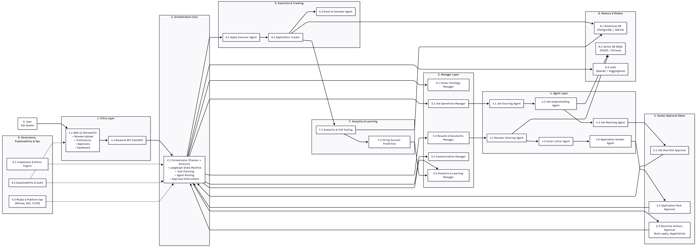
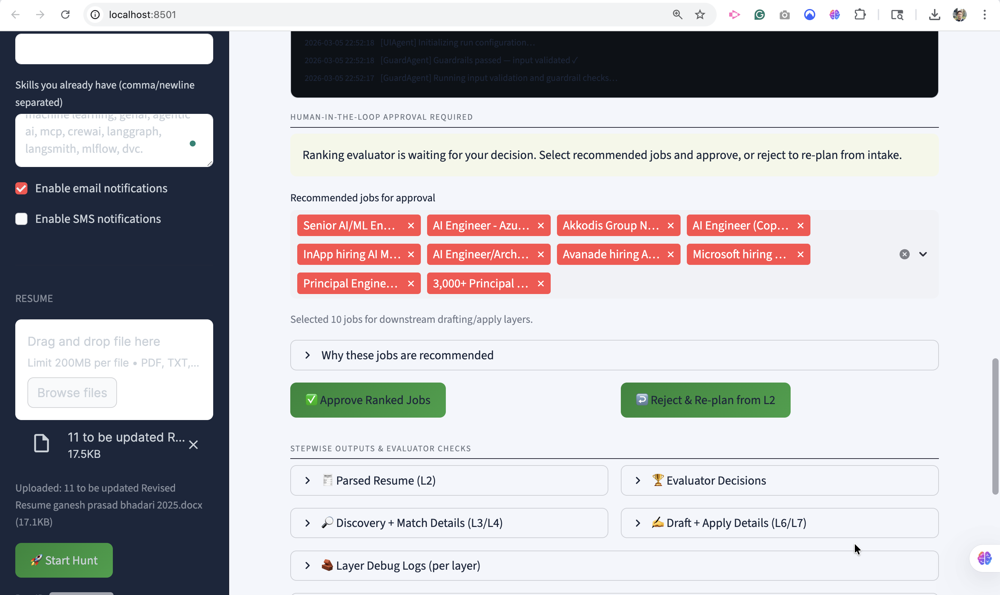
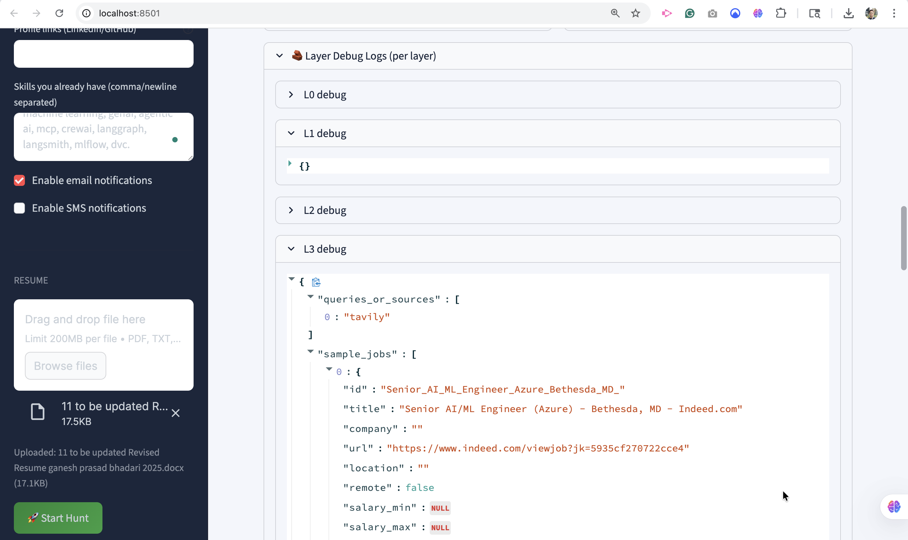
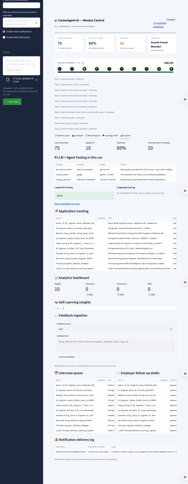

# Portfolio — Ganesh Prasad Bhandari (AI / GenAI / Agentic Systems)

## Snapshot
GenAI / AI Solution Architect who ships **production-grade agentic + RAG systems** and end-to-end AI platforms—built with **evaluation gates, human approvals, and auditability** so automation is reliable, secure, and enterprise-ready.

---

## 1) Flagship build — CareerAgent-AI (CareerOS)
**Repo:** https://github.com/GaneshPrasadBhandari/careeragent-ai

### Demos
- **Recruiter-friendly walkthrough (8–15 min; No voice):** https://youtu.be/_IpHNsKfmmE
- **Deep technical walkthrough (long-form):** https://www.youtube.com/watch?v=xI3dF-FLsy8&t=2255s

### Architecture highlights (6 bullets)
1. **10-layer Career Operating System:** orchestrates the lifecycle end-to-end — Plan → Discover → Match → Prepare → Apply → Track → Learn → Improve.
2. **Evaluator-in-the-loop at every layer:** rubric-based QA gates validate prompts, retrieval grounding, and final artifacts before execution.
3. **Human Approval Gates for sensitive actions:** approvals for job shortlists, final resume/cover letter submission, auto-apply, and negotiation steps.
4. **RAG + Match & Rank Engine:** vector retrieval over user profile + job data with match scoring and interview-likelihood heuristics.
5. **Automation that actually executes:** browser-based job application flows (dynamic forms + uploads) with evidence logs.
6. **Observability + auditability by design:** trace logs per step (reasoning + evidence + outputs) + application tracker store (SQLite → PostgreSQL path).

### Screenshots 
Create `docs/media/` and add:
- `01_architecture.png` — overall system architecture diagram
- `02_mission_control.png` — Streamlit mission control (layer-by-layer progress + approval gates)
- `03_outputs_and_evidence.png` — tailored resume/cover letter + tracker table/evidence log

---

## 2) Published architecture artifacts (Zenodo DOIs)

### Autonomous Orchestration: Multi-Agent Supply Chain Intelligence (2026)
**Zenodo record:** https://zenodo.org/records/18408780  
**DOI:** 10.5281/zenodo.18408780  
**Video:** https://www.youtube.com/watch?v=689c0CfjpQI&t=183s  
**Repo:** https://github.com/GaneshPrasadBhandari/Enterprise-AI-SupplyChain-Architecture-2026

**What it covers (verified from Zenodo description)**
- Tri-Engine AI Decision System: **Probabilistic Forecasting (P10/P50/P90)**, **Constraint-Aware Optimization (MILP/OR-Tools + bounded RL + digital twin sims)**, and **Agentic Decision Intelligence (RAG-grounded Decision Briefs)**.
- Governance + security + human-in-the-loop + explainability; “backbone” tools referenced include **Temporal, LangGraph, MLflow, OPA, Kafka, Delta Lake**.

### OmniBank Agents Architecture (v1.1): AI Agent Operating System for Regulated Banking
**Zenodo record:** https://zenodo.org/records/18423410  
**DOI:** 10.5281/zenodo.18423410  
**Repo:** https://github.com/GaneshPrasadBhandari/omnibank-agents-architecture  
**Related video (supplemental):** https://www.youtube.com/watch?v=nMdX96puPxM

**What it covers (verified from Zenodo description)**
- A bank-grade **control-plane / execution-plane** design: centralized **Orchestrator**, departmental **Manager Agents** (policy-grounded reasoning + constrained retrieval), and **Tool Agents** (permissioned API execution).
- Governance: **approval gating, policy-as-code checks, PII/PCI handling, scoped retrieval, immutable audit logs, model risk management**.
- Platform substrate and “real workflow” depth: **Kafka** eventing, **PostgreSQL + vector store + object storage**, threat model, case studies (KYC, fraud, AML, lending), and an evaluation approach that tests both model quality and control effectiveness.

### AI Health Coach Architecture (v1.0): Production-Grade, Safety-First Healthcare AI
**Zenodo record:** https://zenodo.org/records/18395424  
**DOI:** 10.5281/zenodo.18395424  
**Repo:** https://github.com/GaneshPrasadBhandari/AI-Health-Coach-Architecture  
**Related video (“described by” on Zenodo):** https://www.youtube.com/watch?v=xI3dF-FLsy8

**What it covers (verified from Zenodo description + abstract)**
- Wearable streams + structured symptom inputs → **risk stratification** using deterministic checks + ML risk bands.
- **RAG-grounded explanations** from curated clinical guidance.
- Guardrailed LLM produces constrained, **non-diagnostic** explanations and next-step recommendations aligned to escalation policies.
- Safety gates + uncertainty handling + audit logging + traceability; deployment notes include orchestration, versioning, monitoring (drift, calibration, false reassurance risk), and privacy-aware handling.

---

## 3) Research artifacts (Computer Vision / CDSS)

### IEEE DataPort Dataset (BTXRD-2024 Augmented — Balanced Malignant Class)
**Title:** BTXRD-2024 Augmented Bone Tumor Segmentation and Triage Dataset (Balanced Malignant Class)  
**DOI:** 10.21227/csb2-7x07  
**IEEE DataPort page:** https://ieee-dataport.org/documents/btxrd-2024-augmented-bone-tumor-segmentation-and-triage-dataset-balanced-malignant-class

### Bone tumor detection (YOLOv8) — CDSS manuscript
**Status:** Manuscript in revision.

---

## 4) Skills snapshot (focused)
**Agentic systems:** orchestration, tool routing, state machines, approval workflows  
**RAG + evaluation:** vector search, grounding checks, evaluators, regression tests  
**ML/DS:** Python, SQL, modeling + experimentation, explainability  
**Cloud/MLOps:** CI/CD, Docker, logging/observability, reproducible pipelines

---

### Writing / Thought Leadership
- AI Vanguard (LinkedIn Newsletter): https://www.linkedin.com/newsletters/7220489256505331712/
- Medium (AI Innovations Digest): https://medium.com/@ganeshprasadbhandari79
- https://medium.com/ai-innovations-digest

---

## Contact
LinkedIn: https://www.linkedin.com/in/ganesh-prasad-bhandari-b165b9187/  
GitHub: https://github.com/GaneshPrasadBhandari  
ORCID: https://orcid.org/0009-0002-7308-4279  
Location: Worcester, MA (MSIT graduation May 2026)
